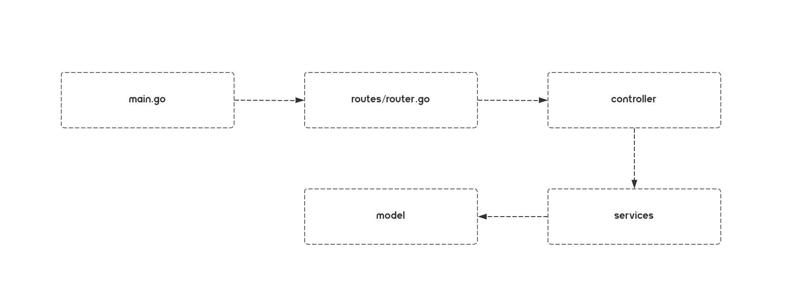

# PetServer

this is the server code repository for the pet project

### Run it?

**Clone And Install dependencies**

```bash
# clone
git clone git@github.com:chagspace/petserver.git
cd petserver

# install dependencies
go mod download
```

**Run server**

```bash
# Arrange docker containers, start postgres server
docker-compose up

# Run go server
go run main.go
```

**Build**

```bash
go build -tags netgo -ldflags "-s -w" -0 app
```

### How it was called?

In other words: how to understand the calling process of this project code faster

**Called process**



the call procedure in the diagram has almost the same name as the project directory, so you can easily see how it works based on this path
