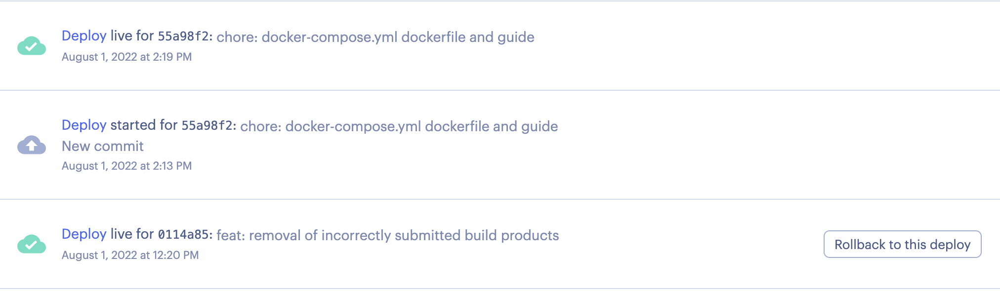

> **Unofficially** <br />
> Current repository is only one of the test versions, and the ongoing repository cannot be open sourced for commercial reasons

# PetServer

this is the server code repository for the pet project

## Run it?

**Clone And Install dependencies**

```bash
# clone
git clone git@github.com:chagspace/petserver.git
cd petserver

# install dependencies
go mod download
go get
```

**Run server**

```bash
# Arrange docker containers, start postgres server
docker-compose up

# Run go server
go run main.go
```

**Build**

```bash
go build -tags netgo -ldflags "-s -w" -0 app
```

## How it was called?

In other words: how to understand the calling process of this project code faster

**Called process**


the call procedure in the diagram has almost the same name as the project directory, so you can easily see how it works based on this path

## How it is deployed?

the ability to run the product of a build on any device, thanks to the nature of golang.

```bash
# build app
go build -tags netgo -ldflags "-s -w" -0 app

# run the app
./app
```

our projects are deployed on [render](https://render.com/) services, which have the advantage of not requiring manual builds and deployments (automated)


